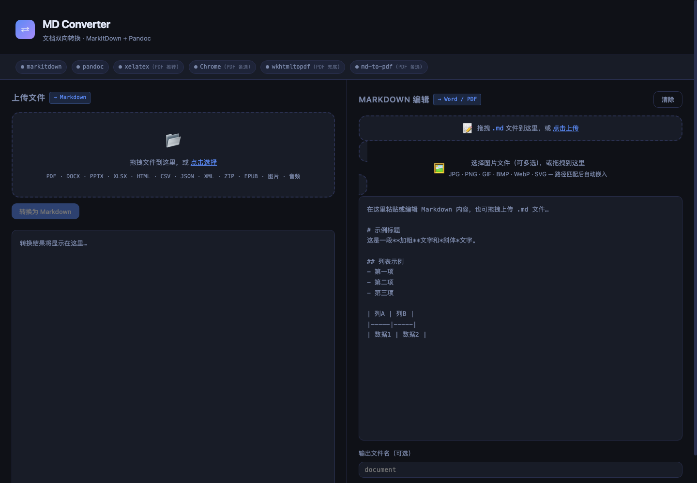

# MD Converter



MD Converter 是一个 **local-first** 的 Markdown 文档转换工作台，基于 **Flask + MarkItDown + Pandoc** 构建。它适合在本机或可信内部网络中处理中文文档、学术笔记、AI 预处理材料，以及 Markdown 到 Word/PDF 的导出。

> 这个项目不是可直接暴露到公网的 SaaS 平台。公开部署前需要额外加入认证、隔离、队列、限流、沙箱和运维监控。

默认访问地址：

```text
Local Python: http://127.0.0.1:5001
Docker:       http://localhost:5000
```

本地 Python 默认使用 `5001` 是为了避开 macOS AirPlay Receiver 常占用的 `5000` 端口；Docker Compose 仍映射到更常见的 `localhost:5000`。

当前支持：

- 其他文件格式转换为 Markdown
- Markdown 转 Word
- Markdown 转 PDF
- Markdown 转 Word/PDF 时上传并匹配本地图片

> 当前项目已经移除了 Markdown 转 HTML 下载/预览功能。

## 功能

| 转换方向 | 支持格式 | 主要依赖 |
|----------|----------|----------|
| 其他格式 → Markdown | PDF · DOCX · PPTX · XLSX · HTML · CSV · JSON · XML · ZIP · EPUB · 图片 · 音频 | MarkItDown |
| Markdown → Word | `.docx`，支持本地图片 | Pandoc |
| Markdown → PDF | `.pdf`，支持本地图片 | Pandoc + XeLaTeX（推荐）/ Chrome / WeasyPrint / wkhtmltopdf |

## 快速开始：本地运行

### 1. 安装系统依赖

**macOS**

```bash
brew install pandoc
brew install --cask mactex
brew install --cask google-chrome
```

**Windows**

```powershell
winget install JohnMacFarlane.Pandoc
winget install MiKTeX.MiKTeX
winget install Google.Chrome
```

安装 MiKTeX 后，建议在 MiKTeX Console 中将 “Install missing packages on-the-fly” 设置为 `Yes`。

**Ubuntu/Debian**

```bash
sudo apt update
sudo apt install -y pandoc texlive-xetex texlive-lang-chinese texlive-latex-extra fonts-noto-cjk chromium wkhtmltopdf
```

### 2. 安装 Python 依赖

```bash
cd md-converter
python -m venv .venv
source .venv/bin/activate
pip install -r requirements.txt
```

Windows PowerShell：

```powershell
cd md-converter
python -m venv .venv
.\.venv\Scripts\Activate.ps1
pip install -r requirements.txt
```

### 3. 启动服务

```bash
python app.py
```

默认访问：

```text
http://127.0.0.1:5001
```

默认 debug 关闭。需要本地调试时显式开启：

```bash
FLASK_DEBUG=1 python app.py
```

## Docker 快速开始

Docker 适合本机或可信内部环境中快速试用：

```bash
docker compose up --build
```

然后访问：

```text
http://localhost:5000
```

Docker 镜像包含 Pandoc、XeLaTeX 中文包、Noto CJK 字体、Chromium、wkhtmltopdf 和 WeasyPrint 运行库。TeX 依赖体积较大，因此镜像会明显大于普通 Flask 应用镜像；这是为了让中文 PDF 导出开箱即用。

## 环境变量

| 变量 | 默认值 | 说明 |
|------|--------|------|
| `MAX_UPLOAD_MB` | `200` | 最大上传体积，单位 MB。非法值会回退到 200。 |
| `PDF_CJK_FONT` | 按平台自动选择 | 指定 XeLaTeX 中文字体，例如 `Noto Serif CJK SC`。 |
| `FLASK_DEBUG` | `0` | 仅设置为 `1`、`true`、`yes` 或 `on` 时开启 debug。 |
| `APP_HOST` | `127.0.0.1` | `python app.py` 绑定地址。Docker Compose 显式设置为 `0.0.0.0`。 |
| `APP_PORT` | `5001` | `python app.py` 监听端口。Docker Compose 显式设置为 `5000`。 |

示例：

```bash
MAX_UPLOAD_MB=512 PDF_CJK_FONT="Noto Serif CJK SC" python app.py
```

## PDF 引擎优先级

Markdown 转 PDF 时，后端按下面顺序尝试：

1. Pandoc + XeLaTeX
2. Chrome headless
3. WeasyPrint
4. wkhtmltopdf
5. md-to-pdf
6. Pandoc 默认 PDF 引擎

中文和数学公式较多的 Markdown，推荐安装 **Pandoc + XeLaTeX + 中文字体**。`wkhtmltopdf` 只作为兜底方案，它对中文字体和 LaTeX 公式支持较弱。

XeLaTeX 中文字体会自动按平台尝试：

- Windows：`Microsoft YaHei`、`SimSun`
- macOS：`PingFang SC`、`Songti SC`
- Linux/Ubuntu：`Noto Serif CJK SC`、`Noto Sans CJK SC`、`WenQuanYi Zen Hei`

## 本地图片处理

Markdown 转 Word/PDF 时，如果文档引用了本地图片，请在右侧图片上传区把图片文件一起加入。

支持的图片路径形式包括：

```markdown


```

后端会按图片文件名匹配并重写到请求级临时目录。如果不同目录下存在同名图片，建议先重命名以避免歧义。

## 接口概览

| 接口 | 方法 | 用途 |
|------|------|------|
| `/` | GET | Web 页面 |
| `/api/check-deps` | GET | 检测本地依赖状态 |
| `/api/to-markdown` | POST | 文件转 Markdown |
| `/api/to-docx` | POST | Markdown 转 Word |
| `/api/to-pdf` | POST | Markdown 转 PDF |

`/api/to-docx` 和 `/api/to-pdf` 使用 `multipart/form-data`：

- `mdfile`：Markdown 文件
- `images`：可选，可上传多张本地图片

## 测试

```bash
python -m unittest discover -s tests
```

测试会 mock 外部命令调用，不要求本机安装 Pandoc、XeLaTeX、Chrome 或 WeasyPrint。

## Deployment Notes

- 默认支持模式是本机或可信内部网络使用。
- `python app.py` 默认只绑定 `127.0.0.1`，不会默认暴露到 `0.0.0.0`。
- Docker Compose 为了容器访问显式设置 `APP_HOST=0.0.0.0`，并映射到宿主机 `localhost:5000`。
- 公开部署建议使用生产 WSGI 服务器、反向代理、TLS、认证、请求队列、资源配额和日志监控。
- 转换任务可能消耗大量 CPU、内存和磁盘空间，内部部署时应限制上传大小和并发量。

## Security Notes

- 这是 local-first 工具，不包含用户系统、权限模型或租户隔离。
- 不要把服务未经保护地暴露到公网。
- 上传文件和转换输出可能包含敏感内容；默认流程会在请求结束后清理临时工作目录和输出文件。
- 外部转换工具会解析用户提供的文件。公开服务场景需要沙箱化转换进程。
- 前端避免把后端错误、文件名和图片名通过 `innerHTML` 注入页面。

## Release Checklist

- [ ] `python -m unittest discover -s tests` 通过
- [ ] 本地 `python app.py` 可访问 `http://127.0.0.1:5001`
- [ ] `docker compose up --build` 可访问 `http://localhost:5000`
- [ ] README 中的系统依赖、环境变量和安全说明已更新
- [ ] 未提交 `uploads/`、`outputs/`、缓存或本地日志
- [ ] 发布前确认 LICENSE、Dockerfile 和 Compose 配置符合预期

## 常见问题

**Q: Markdown 里有本地图片，为什么只上传 `.md` 不行？**  
A: Markdown 里保存的是图片路径，不是图片内容。请在右侧图片上传区把被引用的图片也一起上传。

**Q: PDF 里中文缺失或公式显示成源码怎么办？**  
A: 优先确认 `xelatex` 可用，并安装中文字体。Ubuntu 推荐安装 `fonts-noto-cjk`，Windows 可使用 `Microsoft YaHei`，macOS 可使用 `PingFang SC`。也可以用 `PDF_CJK_FONT` 指定字体。

**Q: 为什么 wkhtmltopdf 只是兜底？**  
A: `wkhtmltopdf` 使用较老的 WebKit 渲染能力，对现代 CSS、中文字体和 LaTeX 公式支持有限。中文数学文档建议走 Pandoc + XeLaTeX。

**Q: MarkItDown 显示红色怎么办？**  
A: 先确认当前 Python 环境已经运行 `pip install -r requirements.txt`，然后执行 `markitdown --version` 检查命令是否可用。

**Q: 图片/音频文件转换效果不佳？**  
A: 图片 OCR 和音频转录需要配置 LLM，可在 `app.py` 中扩展 `to_markdown` 路由添加 `llm_client` 参数。默认项目不会把文件上传到外部服务。
