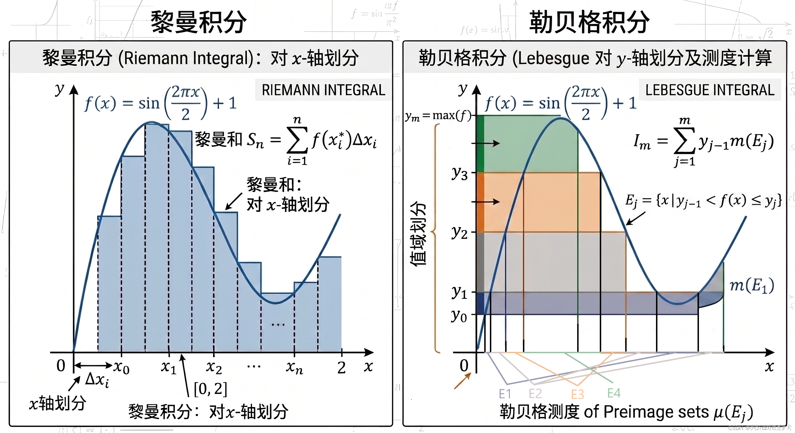
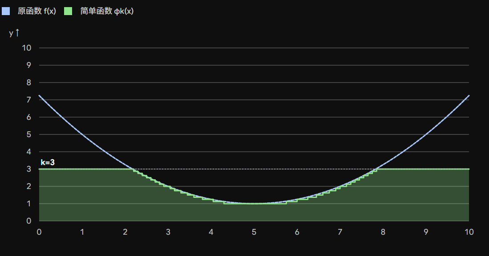

# 实分析入门：可测函数与简单函数逼近

&emsp; 在第一章里，我们一直在讨论“哪些集合可以被测量”。这个问题最后把我们带到了 $\sigma-$代数、Borel 集、Lebesgue 可测集这些概念。

&emsp; 现在进入第二章之后，我们的关注对象会从“集合”慢慢转向“函数”。因为积分本质上不是直接对集合做事情，而是对函数做事情。所以在正式定义 Lebesgue 积分之前，我们必须先回答一个问题：

$$
\boxed{\text{什么样的函数是可以被积分的？}}
$$

&emsp; 对 Riemann 积分来说，我们通常只在区间上讨论有界函数，然后通过分割区间来定义积分。但是 Lebesgue 积分的思路不一样。它的基础不是区间分割，而是可测集合。因此，想要对函数积分，函数就必须和可测集合结构相容。

&emsp; 这种“和可测集合结构相容”的函数，就叫做**可测函数**。

## 从集合可测到函数可测

&emsp; 我们先回忆一下：在一个可测空间 $(X,\Sigma)$ 里，$\Sigma$ 里的集合被称为可测集。

&emsp; 如果现在有一个函数

$$
f:X\to\mathbb R,
$$

&emsp; 那么我们怎么判断它是不是“可测”的呢？

&emsp; 一个自然的想法是：既然函数把 $X$ 中的点送到 $\mathbb R$ 上，那么我们可以拿 $\mathbb R$ 里的集合 $E$，看它在 $X$ 中的逆像：

$$
f^{-1}(E)=\{x\in X:f(x)\in E\}.
$$

&emsp; 如果 $E$ 是 $\mathbb R$ 上的 Borel 集，那么我们希望 $f^{-1}(E)$ 是 $X$ 中的可测集。也就是说，$f$ 不应该把一个正常的 Borel 集拉回成一个不可测的怪集合。这就是可测函数最本质的想法：

$$
\boxed{
\text{函数 }f\text{ 可测} \iff \text{Borel 集的逆像仍然可测。}
}
$$

&emsp; 不过在实际定义时，我们不需要一上来检查所有 Borel 集的逆像。更容易操作的条件是：检查上水平集。

## 可测函数的定义

&emsp; **定义 2.1.1：** 设 $(X,\Sigma)$ 是一个可测空间，$f:X\to\mathbb R$。如果对任意 $t\in\mathbb R$，集合

$$
S_f(t):=\{x\in X:f(x)>t\}
$$

&emsp; 都属于 $\Sigma$，那么称 $f$ 是 $\Sigma-$可测的。若上下文里 $\Sigma$ 已经明确，也直接说 $f$ 是可测函数，这里

$$
S_f(t)=\{x:f(x)>t\}
$$

&emsp; 叫做 $f$ 的**上水平集**。

&emsp; 这里就涉及到这样一个问题：为什么要定义上水平集？这里就要回到这一章的标题：**积分** 上来了。我们来回忆一下数学分析中我们熟悉的黎曼积分是怎么做的，$f(x)$ 在 $[a, b]$ 上的黎曼积分首先把 $[a, b]$ 区间分成 $n$ 份，然后求黎曼和的极限：
$$
\int_a^b f(x)dx = \lim_{n \to \infty}\sum_{i = 1}^n \frac{b - a}n \cdot f(\xi_i)
$$
&emsp; 其中 $\xi_i \in (a + \frac {b - q}n(i - 1), a + \frac {b - q}ni]$

&emsp; 而在实分析中，我们做的不是黎曼积分，而是 Lebesgue 积分，与黎曼积分不同的是，我们不对 $x$ 轴上的 $[a,b]$ 做划分，反过来我们对 $y$ 轴上的值域做划分，如图：

&emsp; 我们让 $E_j = \{ x : y_{j - 1} < f(x)\leq y_i \} = S_f(y_{j - 1}) \setminus S_f(y_j)$，也就是函数值夹在 $(y_{j - 1}, y_j)$ 中间的集合，那么我们可以估计这一段的面积大概就是 $y_{j - 1}m(E_j)$，然后就可以用勒贝格和的极限逼近积分：
$$
l_m = \sum_{j = 1}^m y_{j - 1}m(E_j)
$$
&emsp; 所以我们需要定义上水平集来方便我们定义 Lebesgue 积分。并且如果对每个高度 $t$，这些点组成的集合都是可测的，那么这个函数就和可测结构是相容的。也就是说，可测函数要求：
$$
\boxed{
\text{每一层水平线以上的区域都应该是可测集。}
}
$$

## 为什么只检查上水平集就够了？

&emsp; 看到这里可能会有一个问题：为什么定义里只要求

$$
\{x:f(x)>t\}
$$

&emsp; 可测，而不是要求所有 Borel 集的逆像都可测？答案是：这两个要求其实等价：**Proposition 2.1.2：** 设 $(X,\Sigma)$ 是一个可测空间，$f:X\to\mathbb R$ 那么下面几件事等价

1. $f$ 是可测函数；
2. 对任意 $a\in\mathbb R$，有 $f^{-1}([a,\infty))\in\Sigma$

3. 对任意 $a\in\mathbb R$，有 $f^{-1}((-\,\infty,a))\in\Sigma$

4. 对任意 $a\in\mathbb R$，有 $f^{-1}((-\,\infty,a])\in\Sigma$

5. 对任意 Borel 集 $E\in\mathcal B_{\mathbb R}$，有 $f^{-1}(E)\in\Sigma$

&emsp; 这个命题的意思是：你可以用很多不同方式判断函数可测。可以看上水平集，也可以看下水平集，也可以看闭射线，也可以直接看所有 Borel 集的逆像。

&emsp; 这些说法本质上都一样。

## 证明思路：从上水平集推出 Borel 逆像可测

&emsp; 我们重点看最核心的一步：如果 $f$ 可测，为什么对所有 Borel 集 $E$ 都有

$$
f^{-1}(E)\in\Sigma?
$$

&emsp; 这个证明非常典型，因为它又一次用到了“生成的 $\sigma-$代数”的思想。我们定义一个集合族：

$$
\mathcal F=\{E\subset\mathbb R:f^{-1}(E)\in\Sigma\}.
$$

&emsp; 也就是说，$\mathcal F$ 是所有“逆像是可测集”的 $\mathbb R$ 的子集组成的集合族。

&emsp; 现在我们的目标就是证明：

$$
\mathcal B_{\mathbb R}\subset\mathcal F.
$$

&emsp; 因为这就说明所有 Borel 集的逆像都可测。

&emsp; 怎么证明呢？老套路：先证明 $\mathcal F$ 是一个 $\sigma-$代数，然后证明它包含所有开区间。然后再用开区间的可数的交并补生成出所有 Borel 集，于是它们就都被包含在内了。

### 第一步：$\mathcal F$ 是 $\sigma-$代数

&emsp; 首先，

$$
\varnothing\in\mathcal F,
$$

&emsp; 因为

$$
f^{-1}(\varnothing)=\varnothing\in\Sigma.
$$

&emsp; 其次，如果 $E\in\mathcal F$，那么

$$
f^{-1}(E)\in\Sigma.
$$

&emsp; 而

$$
f^{-1}(E^c)=(f^{-1}(E))^c.
$$

&emsp; 因为 $\Sigma$ 对补集封闭，所以

$$
f^{-1}(E^c)\in\Sigma.
$$

&emsp; 因此

$$
E^c\in\mathcal F.
$$

&emsp; 最后，如果 $E_1,E_2,\cdots\in\mathcal F$，那么

$$
f^{-1}\left(\bigcup_{j=1}^{\infty}E_j\right)
=
\bigcup_{j=1}^{\infty}f^{-1}(E_j).
$$

&emsp; 每个 $f^{-1}(E_j)$ 都在 $\Sigma$ 中，而 $\Sigma$ 对可数并封闭，所以

$$
f^{-1}\left(\bigcup_{j=1}^{\infty}E_j\right)\in\Sigma.
$$

&emsp; 因此

$$
\bigcup_{j=1}^{\infty}E_j\in\mathcal F.
$$

&emsp; 三条性质都满足，所以 $\mathcal F$ 是一个 $\sigma-$代数。

### 第二步：$\mathcal F$ 包含所有开区间

&emsp; 根据可测函数的定义，我们知道对任意 $t\in\mathbb R$，

$$
f^{-1}((t,\infty))=\{x:f(x)>t\}\in\Sigma.
$$

&emsp; 所以每个形如 $(t,\infty)$ 的开射线都属于 $\mathcal F$。

&emsp; 利用补集和可数并、可数交，我们可以进一步得到各种区间的逆像可测。比如

$$
(-\infty,a]
=
(a,\infty)^c,
$$

&emsp; 所以

$$
f^{-1}((-
\infty,a])\in\Sigma.
$$

&emsp; 又比如

$$
(a,b)=(-\infty,b)\cap(a,\infty).
$$

&emsp; 因此开区间的逆像也是可测的。

&emsp; 所以 $\mathcal F$ 包含所有开区间。

&emsp; 但是 Borel $\sigma-$代数 $\mathcal B_{\mathbb R}$ 正是由所有开区间生成的最小 $\sigma-$代数。现在 $\mathcal F$ 是一个 $\sigma-$代数，并且包含所有开区间，所以必然有

$$
\mathcal B_{\mathbb R}\subset\mathcal F.
$$

&emsp; 于是对任意 Borel 集 $E$，

$$
f^{-1}(E)\in\Sigma.
$$

&emsp; 这就证明了我们想要的结论。

## 一般可测空间之间的可测映射

&emsp; 上面我们讨论的是

$$
f:X\to\mathbb R.
$$

&emsp; 但其实可测函数的概念可以推广到一般可测空间之间：如果 $(X,\Sigma)$ 和 $(Y,\mathcal M)$ 是两个可测空间，$f:X\to Y$，那么我们称 $f$ 是 $(\Sigma,\mathcal M)-$可测的，如果对任意 $E\in\mathcal M$，都有 $f^{-1}(E)\in\Sigma$

&emsp; 也就是说：目标空间里的可测集，被 $f$ 拉回到原空间以后，仍然是可测集。这和拓扑里连续函数的定义很像。

&emsp; 连续函数要求：

$$
\text{开集的逆像仍然是开集。}
$$

&emsp; 可测函数要求：

$$
\text{可测集的逆像仍然是可测集。}
$$

&emsp; 所以可以粗略地理解为：

$$
\boxed{
\text{可测函数是测度论里的“连续函数”。}
}
$$

&emsp; 当然，这句话只是类比。可测函数比连续函数弱得多。**连续函数一定是 Borel 可测的**，但是可测函数不一定连续，甚至可以非常不连续。

### 连续函数为什么一定 Borel 可测

&emsp; 上面说“连续函数一定是 Borel 可测”，这件事也应该说明一下。它其实就是“开集生成 Borel 集”这一点和“连续函数保持开集逆像”的结合，设

$$
h:\mathbb R^m\to\mathbb R^n
$$

&emsp; 是连续函数。我们要证明 $h$ 是 Borel 可测的，也就是对任意

$$
E\in\mathcal B_{\mathbb R^n},
$$

&emsp; 都有

$$
h^{-1}(E)\in\mathcal B_{\mathbb R^m}.
$$

&emsp; 还是用老办法：把所有逆像是 Borel 集的集合收集起来。令

$$
\mathcal G
=
\{E\subset\mathbb R^n:h^{-1}(E)\in\mathcal B_{\mathbb R^m}\}.
$$

&emsp; 先看 $\mathcal G$ 是不是一个 $\sigma-$代数。

&emsp; 因为

$$
h^{-1}(\mathbb R^n)=\mathbb R^m\in\mathcal B_{\mathbb R^m},
$$

&emsp; 所以 $\mathbb R^n\in\mathcal G$。如果 $E\in\mathcal G$，那么

$$
h^{-1}(E^c)=\mathbb R^m\setminus h^{-1}(E),
$$

&emsp; 右边是 Borel 集，所以 $E^c\in\mathcal G$。如果 $E_1,E_2,\cdots\in\mathcal G$，那么

$$
h^{-1}\left(\bigcup_{j=1}^{\infty}E_j\right)
=
\bigcup_{j=1}^{\infty}h^{-1}(E_j),
$$

&emsp; 右边仍然是 Borel 集，所以 $\bigcup_{j=1}^{\infty}E_j\in\mathcal G$。因此 $\mathcal G$ 是一个 $\sigma-$代数。

&emsp; 接下来，由于 $h$ 连续，对任意开集 $O\subset\mathbb R^n$，都有

$$
h^{-1}(O)\text{ 是 }\mathbb R^m\text{ 中的开集}.
$$

&emsp; 开集当然是 Borel 集，所以

$$
h^{-1}(O)\in\mathcal B_{\mathbb R^m}.
$$

&emsp; 也就是说，所有开集 $O\subset\mathbb R^n$ 都属于 $\mathcal G$。

&emsp; 但 $\mathcal B_{\mathbb R^n}$ 正是由 $\mathbb R^n$ 中所有开集生成的最小 $\sigma-$代数。现在 $\mathcal G$ 是一个 $\sigma-$代数，而且包含所有开集，所以必然有

$$
\mathcal B_{\mathbb R^n}\subset\mathcal G.
$$

&emsp; 因此对任意 Borel 集 $E\in\mathcal B_{\mathbb R^n}$，

$$
h^{-1}(E)\in\mathcal B_{\mathbb R^m}.
$$

&emsp; 这就证明了连续函数一定是 Borel 可测的。

&emsp; 这条结论后面会反复使用。比如坐标投影、加法函数、乘法函数都是连续函数，所以它们都是 Borel 可测的。

## 向量值函数的可测性

&emsp; 接下来我们还需要讨论讨论向量值函数，设：

$$
f:X\to\mathbb R^n.
$$

&emsp; 我们可以把它写成

$$
f(x)=(f_1(x),f_2(x),\cdots,f_n(x)),
$$

&emsp; 其中每个

$$
f_j:X\to\mathbb R
$$

&emsp; 是第 $j$ 个分量函数。

&emsp; 那么一个很自然的问题是：判断 $f:X\to\mathbb R^n$ 可测，是不是只需要判断每个分量 $f_j$ 可测？答案是肯定的：

&emsp; **Proposition 2.1.3：** 设 $(X,\Sigma)$ 是可测空间，$f:X\to\mathbb R^n$，并令 $P_j:\mathbb R^n\to\mathbb R$ 是第 $j$ 个坐标投影。那么

$$
f\text{ 可测}
\iff
f_j=P_j\circ f\text{ 可测，对所有 }j.
$$

&emsp; 这个结论非常合理。因为 $\mathbb R^n$ 上的 Borel 结构本来就是由各个坐标方向的 Borel 集生成出来的。也就是说，想知道一个点 $f(x)$ 在 $\mathbb R^n$ 里落在哪里，只需要知道它每个坐标落在哪里。

&emsp; 所以向量值函数的可测性可以拆成每个分量的可测性。

&emsp; 我们把证明写一下。这个证明并不难，但它很值得写出来，因为后面证明 $f+g,fg$ 可测时会直接用到它。

&emsp; 先证明从左到右。假设

$$
f:X\to\mathbb R^n
$$

&emsp; 是可测的。我们要证明每个分量

$$
f_j=P_j\circ f
$$

&emsp; 都是可测的。

&emsp; 按照可测函数的定义，只要证明对任意 Borel 集 $B\in\mathcal B_{\mathbb R}$，

$$
f_j^{-1}(B)\in\Sigma.
$$

&emsp; 但是

$$
\begin{aligned}
f_j^{-1}(B)
&=\{x\in X:f_j(x)\in B\}\\
&=\{x\in X:P_j(f(x))\in B\}\\
&=\{x\in X:f(x)\in P_j^{-1}(B)\}\\
&=f^{-1}(P_j^{-1}(B)).
\end{aligned}
$$

&emsp; 现在 $P_j:\mathbb R^n\to\mathbb R$ 是连续函数。根据刚刚证明的小引理，$P_j$ 是 Borel 可测的。因此如果 $B$ 是 $\mathbb R$ 中的 Borel 集，那么

$$
P_j^{-1}(B)\in\mathcal B_{\mathbb R^n}.
$$

&emsp; 又因为 $f$ 可测，所以

$$
f^{-1}(P_j^{-1}(B))\in\Sigma.
$$

&emsp; 也就是

$$
f_j^{-1}(B)\in\Sigma.
$$

&emsp; 于是每个分量函数 $f_j$ 都可测。

&emsp; 再证明必要性：假设每个 $f_j:X\to\mathbb R$ 都是可测函数。我们要证明 $f:X\to\mathbb R^n$ 可测。也就是说，对任意 Borel 集 $E\in\mathcal B_{\mathbb R^n}$，我们要证明：

$$
f^{-1}(E)\in\Sigma.
$$

&emsp; 这里又用到一个很熟悉的套路：先不要直接处理所有 Borel 集，而是把“逆像可测”的集合全部收集起来。令

$$
\mathcal C
=
\{E\subset\mathbb R^n:f^{-1}(E)\in\Sigma\}.
$$

&emsp; 如果我们能证明

$$
\mathcal B_{\mathbb R^n}\subset\mathcal C,
$$

&emsp; 那就说明所有 Borel 集的逆像都可测，也就是 $f$ 可测。

&emsp; 首先，$\mathcal C$ 是一个 $\sigma-$代数。因为

$$
f^{-1}(\mathbb R^n)=X\in\Sigma.
$$

&emsp; 如果 $E\in\mathcal C$，那么 $f^{-1}(E)\in\Sigma$，于是

$$
f^{-1}(E^c)=X\setminus f^{-1}(E)\in\Sigma,
$$

&emsp; 所以 $E^c\in\mathcal C$。如果 $E_1,E_2,\cdots\in\mathcal C$，那么

$$
f^{-1}\left(\bigcup_{k=1}^{\infty}E_k\right)
=
\bigcup_{k=1}^{\infty}f^{-1}(E_k)\in\Sigma,
$$

&emsp; 所以 $\bigcup_{k=1}^{\infty}E_k\in\mathcal C$。因此 $\mathcal C$ 的确是一个 $\sigma-$代数。

&emsp; 接下来只要证明 $\mathcal C$ 包含 $\mathbb R^n$ 中的开集。因为一旦它包含所有开集，而 $\mathcal B_{\mathbb R^n}$ 正是由开集生成的最小 $\sigma-$代数，就必然有

$$
\mathcal B_{\mathbb R^n}\subset\mathcal C.
$$

&emsp; 先看一个开矩形：

$$
R=(a_1,b_1)\times(a_2,b_2)\times\cdots\times(a_n,b_n).
$$

&emsp; 那么

$$
\begin{aligned}
f^{-1}(R)
&=
\{x\in X:f(x)\in R\}\\
&=
\{x\in X:a_1<f_1(x)<b_1,\cdots,a_n<f_n(x)<b_n\}\\
&=
\bigcap_{j=1}^{n}f_j^{-1}((a_j,b_j)).
\end{aligned}
$$

&emsp; 由于每个 $f_j$ 都可测，所以

$$
f_j^{-1}((a_j,b_j))\in\Sigma.
$$

&emsp; 又因为 $\Sigma$ 对有限交封闭，所以

$$
f^{-1}(R)\in\Sigma.
$$

&emsp; 于是所有开矩形都属于 $\mathcal C$。

&emsp; 但开集不一定是一个矩形，它可能长得很乱。不过在 $\mathbb R^n$ 里，每个开集都可以写成可数个开矩形的并。更准确地说，每个开集 $O\subset\mathbb R^n$ 都可以写成所有满足

$$
Q\subset O
$$

&emsp; 的有理开矩形 $Q$ 的并。这里“有理开矩形”指的是端点都是有理数的开矩形：

$$
Q=(q_1,r_1)\times\cdots\times(q_n,r_n),
\qquad
q_j,r_j\in\mathbb Q.
$$

&emsp; 为什么这样可以？如果 $y\in O$，因为 $O$ 是开集，所以可以找到一个小球 $B(y,\varepsilon)\subset O$。再利用有理数在实数中的稠密性，我们可以在这个小球里面塞进一个包含 $y$ 的有理开矩形 $Q$，并且让

$$
y\in Q\subset O.
$$

&emsp; 所以 $O$ 中的每个点都会被某个有理开矩形覆盖。另一方面，这些有理开矩形本来就都包含在 $O$ 里，因此它们的并恰好就是 $O$。

&emsp; 而有理开矩形只有可数多个，因为它们由有限多个有理端点决定。所以 $O$ 是可数个开矩形的并。每个开矩形都属于 $\mathcal C$，而 $\mathcal C$ 是 $\sigma-$代数，所以

$$
O\in\mathcal C.
$$

&emsp; 这说明 $\mathcal C$ 包含所有开集。于是

$$
\mathcal B_{\mathbb R^n}\subset\mathcal C.
$$

&emsp; 因此对任意 $E\in\mathcal B_{\mathbb R^n}$，都有

$$
f^{-1}(E)\in\Sigma.
$$

&emsp; 也就是说 $f$ 可测。两边合起来，就证明了

$$
f\text{ 可测}
\iff
f_j\text{ 对所有 }j\text{ 都可测}.
$$

## 可测函数的稳定性

&emsp; 可测函数的定义说完了，接下来我们要看一件非常重要的事情：可测函数在常见运算下是稳定的，也就是可测函数在进行加减乘除之后是不是仍然是可测的

&emsp; 具体来说，如果 $f,g$ 都可测，那么我们希望

$$
f+g,
\qquad
fg,
\qquad
\max(f,g),
\qquad
\min(f,g)
$$

&emsp; 也都可测。

&emsp; 这件事非常重要。因为如果可测函数做一点普通代数运算就不可测了，那后面的积分理论就根本没法用。

### 和与积仍然可测

&emsp; **Proposition 2.1.4：** 如果 $f,g:X\to\mathbb R$ 都是可测函数，那么 $f+g$ 和 $fg$ 都是可测函数。

&emsp; 证明思路很漂亮，我们先把 $f$ 和 $g$ 合成一个向量值函数：

$$
F:X\to\mathbb R^2,
\qquad
F(x)=(f(x),g(x)).
$$

&emsp; 因为 $f,g$ 都可测，所以根据刚才的向量值函数命题，$F$ 是可测的。

&emsp; 然后定义连续函数

$$
\varphi:\mathbb R^2\to\mathbb R,
\qquad
\varphi(z,w)=z+w.
$$

&emsp; 那么

$$
f+g=\varphi\circ F.
$$

&emsp; 连续函数是 Borel 可测的，而可测函数的复合仍然可测，所以 $f+g$ 可测。

&emsp; 同理，对乘法函数

$$
\psi(z,w)=zw
$$

&emsp; 也一样。因为 $\psi$ 是连续函数，所以

$$
fg=\psi\circ F
$$

&emsp; 也是可测函数。

### 上确界、下确界和极限仍然可测

&emsp; 现在再考虑函数列。

&emsp; 假设

$$
f_1,f_2,f_3,\cdots
$$

&emsp; 是一列可测函数。我们经常会对它们取

$$
\sup_j f_j,
\qquad
\inf_j f_j,
\qquad
\limsup_{j\to\infty}f_j,
\qquad
\liminf_{j\to\infty}f_j.
$$

&emsp; 那么这些函数是否仍然可测？答案也是肯定的。

&emsp; **Proposition 2.1.5：** 如果 $(f_j)_{j=1}^{\infty}$ 是一列 $\overline{\mathbb R}$-值可测函数，那么

$$
\sup_j f_j,
\qquad
\inf_j f_j,
\qquad
\limsup_{j\to\infty}f_j,
\qquad
\liminf_{j\to\infty}f_j
$$

&emsp; 都是可测函数。因此，如果

$$
\lim_{j\to\infty}f_j
$$

&emsp; 存在，那么这个极限函数也是可测的，我们看一下 $\sup$ 的证明。

&emsp; 令

$$
g(x)=\sup_j f_j(x).
$$

&emsp; 那么

$$
\{x:g(x)>t\}
=
\bigcup_{j=1}^{\infty}\{x:f_j(x)>t\}.
$$

&emsp; 因为 $g(x)>t$ 的意思就是：至少有一个 $j$，使得 $f_j(x)>t$。

&emsp; 每个集合

$$
\{x:f_j(x)>t\}
$$

&emsp; 都是可测的，而 $\Sigma$ 对可数并封闭，所以

$$
\{x:g(x)>t\}\in\Sigma.
$$

&emsp; 因此 $g$ 可测。

&emsp; 至于 $\inf$，可以写成

$$
\inf_j f_j=-\sup_j(-f_j).
$$

&emsp; 所以也是可测的。

&emsp; 再看上下极限：

$$
\limsup_{j\to\infty}f_j
=
\inf_{k\ge1}\sup_{j\ge k}f_j,
$$

$$
\liminf_{j\to\infty}f_j
=
\sup_{k\ge1}\inf_{j\ge k}f_j.
$$

&emsp; 所以它们也是可测函数。

&emsp; 这个命题很重要，因为它告诉我们：

$$
\boxed{
\text{可测函数列取逐点极限，仍然是可测函数。}
}
$$

&emsp; 这正是后面各种收敛定理能成立的基础。

### 最大值、最小值、正部和负部

&emsp; 由上面的结论，我们马上可以得到：如果 $f,g$ 可测，那么 $\max(f,g)$ 和 $\min(f,g)$ 也是可测函数，因为：

$$
\max(f,g)=\sup\{f,g\},
$$

$$
\min(f,g)=\inf\{f,g\}.
$$

&emsp; 进一步，我们可以定义一个函数的正部和负部。

&emsp; **定义 2.1.7：** 对任意 $f:X\to\mathbb R$，定义

$$
f^+(x):=\max(f(x),0),
$$

$$
f^-(x):=\max(-f(x),0).
$$

&emsp; $f^+$ 叫做 $f$ 的正部，$f^-$ 叫做 $f$ 的负部。

&emsp; 它们满足

$$
f=f^+-f^-.
$$

&emsp; 也就是说，一个实值函数可以拆成“正的部分”减去“负的部分”。

&emsp; 同时还有

$$
|f|=f^++f^-.
$$

&emsp; 如果 $f$ 是可测函数，那么 $f^+$ 和 $f^-$ 都可测。

&emsp; 这个分解后面非常重要。因为 Lebesgue 积分通常先定义非负函数的积分，然后对一般实值函数用 $f=f^+-f^-$ 来处理。

## 示性函数和简单函数

&emsp; 接下来我们进入一个非常重要的概念：简单函数。

&emsp; 在讲积分之前，简单函数扮演的角色有点像 Riemann 积分里的阶梯函数。它们是最容易积分的函数，同时又可以用来逼近一般可测函数。

&emsp; 先定义示性函数：如果 $E\subset X$，则 $E$ 的示性函数 $\mathbb{1}_E$ 定义为

$$
\mathbb{1}_E(x)=
\begin{cases}
1,&x\in E,\\
0,&x\notin E.
\end{cases}
$$

&emsp; 也就是说，$\mathbb{1}_E$ 只负责记录一个点是否属于集合 $E$。如果 $E\in\Sigma$，那么 $\mathbb{1}_E$ 是可测函数。因为它的上水平集只有几种可能：空集、$E$ 或者整个 $X$，这些都是可测集。

&emsp; **定义 2.1.8：** 一个函数 $\phi:X\to\mathbb R$ 称为简单函数，如果它可以写成有限个示性函数的线性组合：

$$
\phi=\sum_{j=1}^{n}y_j\mathbb{1}_{E_j},
\qquad
E_j\in\Sigma.
$$

&emsp; 也就是说，简单函数只取有限多个值，并且每个取值区域都是可测集。直观上，简单函数就是把空间 $X$ 分成有限块，然后在每一块上取一个常数，比如：

$$
\phi(x)=3\cdot\mathbb{1}_A(x)+5\cdot\mathbb{1}_B(x)-2\cdot\mathbb{1}_C(x).
$$

&emsp; 它的值只由 $x$ 落在哪些可测集合里决定。简单函数显然是可测的，并且简单函数之间做加法、乘法，结果仍然是简单函数。

## 为什么简单函数重要？

&emsp; 简单函数重要的原因是：

$$
\boxed{
\text{任意非负可测函数都可以被简单函数从下方逼近。}
}
$$

&emsp; 这是 Lebesgue 积分最核心的思想之一。Riemann 积分的思路是把定义域分成很多小区间，然后用矩形面积逼近函数下面积。Lebesgue 积分的思路更像是把函数值域分层：看函数落在某个高度区间内的点组成什么集合，然后用简单函数逐层逼近。这种逼近方式非常适合可测函数，因为每一层的集合都是可测集。

## 简单函数逼近定理

&emsp; **Theorem 2.1.9：** 设 $(X,\Sigma)$ 是一个可测空间。

&emsp; 1. 如果 $f:X\to[0,\infty]$ 是可测函数，那么存在一列简单函数 $(\phi_n)$，使得 $0\le \phi_1\le\phi_2\le\cdots\le\phi_n\le\cdots\le f,$ 并且 $\phi_n(x)\to f(x)$ 对每个 $x$ 都成立。

&emsp; 2. 如果 $f:X\to\overline{\mathbb R}$ 是可测函数，那么存在一列简单函数 $(\phi_n)$，使得 $0\le |\phi_1|\le |\phi_2|\le\cdots\le |\phi_n|\le\cdots\le |f|,$ 并且 $\phi_n(x)\to f(x).$

&emsp; 3. 如果 $f$ 有界，那么可以做到一致收敛。

### 非负情形的构造

&emsp; 我们重点看非负函数的构造，因为这是后面定义积分时真正要用的。假设 $f:X\to[0,\infty]$ 可测。对每个 $k\ge1$，我们把区间 $[0,k]$ 分成很多小段，每段长度是 $2^{-k}$

&emsp; 然后定义

$$
E_k^j=
\left\{x\in X:\frac{j-1}{2^k}\le f(x)<\frac{j}{2^k}\right\},
\qquad
j=1,2,\cdots,k2^k.
$$

&emsp; 再定义

$$
E_k=\{x\in X:f(x)\ge k\}.
$$

&emsp; 于是整个 $X$ 被分成这些可测块：

$$
X=E_k\cup\left(\bigcup_{j=1}^{k2^k}E_k^j\right).
$$

&emsp; 在每个 $E_k^j$ 上，函数 $f$ 的值落在

$$
\left[\frac{j-1}{2^k},\frac{j}{2^k}\right)
$$

&emsp; 里面。于是我们用左端点来近似它。

&emsp; 定义简单函数（如图，画出了 $k = 3$ 的情形：）

$$
\phi_k(x)
=
k\mathbb{1}_{E_k}(x)+
\sum_j\frac{j-1}{2^k}\mathbb{1}_{E_k^j}(x).
$$

&emsp; 这个定义的意思是：

- 如果 $f(x)\ge k$，就让 $\phi_k(x)=k$；
- 如果 $f(x)$ 落在某个小区间

$$
\left[\frac{j-1}{2^k},\frac{j}{2^k}\right),
$$

&emsp; 就让 $\phi_k(x)$ 等于这个小区间的左端点。

&emsp; 所以 $\phi_k$ 总是从下方逼近 $f$：

$$
0\le \phi_k(x)\le f(x).
$$

&emsp; 而且随着 $k$ 增大，分割越来越细，截断高度也越来越高，所以

$$
\phi_k(x)\to f(x).
$$

&emsp; 如果 $f(x)<\infty$，那么当 $k$ 足够大时，$f(x)<k$，并且

$$
0\le f(x)-\phi_k(x)<\frac1{2^k}.
$$

&emsp; 所以

$$
\phi_k(x)\to f(x).
$$

&emsp; 如果 $f(x)=\infty$，那么

$$
\phi_k(x)=k
$$

&emsp; 对足够大的 $k$ 成立，所以

$$
\phi_k(x)\to\infty=f(x).
$$

&emsp; 这就证明了非负可测函数可以被简单函数逐点逼近。

### 一般实值函数的情形

&emsp; 如果 $f$ 不一定非负，我们就利用正负部分分解：

$$
f=f^+-f^-.
$$

&emsp; 因为 $f^+$ 和 $f^-$ 都是非负可测函数，所以可以分别找到简单函数

$$
\varphi_k\uparrow f^+,
$$

$$
\psi_k\uparrow f^-.
$$

&emsp; 然后令

$$
\phi_k=\varphi_k-\psi_k.
$$

&emsp; 那么 $\phi_k$ 是简单函数，并且 $\phi_k\to f.$ 所以一般可测函数也可以用简单函数逼近。

### 有界函数时的一致收敛

&emsp; 如果 $f$ 是有界函数，那么事情会更好。因为这时候 $f$ 的值不会跑到无穷远。也就是说，存在某个 $M>0$，使得

$$
|f(x)|\le M
$$

&emsp; 对所有 $x$ 成立。

&emsp; 当 $k$ 足够大时，我们的截断高度 $k$ 已经超过 $M$，所以不会再发生 $f(x)\ge k$ 的情况。此时误差完全由分割精度控制：

$$
0\le f(x)-\phi_k(x)<2^{-k}.
$$

&emsp; 这个估计对所有 $x$ 同时成立，所以 $\phi_k\to f$ 是一致收敛。

&emsp; 这就说明：

$$
\boxed{
\text{有界可测函数不仅可以被简单函数逐点逼近，还可以一致逼近。}
}
$$

## 除去零测集的问题

&emsp; 在测度论里，我们经常认为零测集上的差别可以忽略。那么自然就会问：如果一个函数和可测函数只差一个零测集，它是不是也可测？答案是：在完备测度空间里，是的：

&emsp; **Proposition 2.1.10：** 设 $(X,\Sigma,\mu)$ 是完备测度空间。

&emsp; 1. 如果 $f$ 可测，并且 $f=g\quad \mu\text{-a.e. on }E$ 那么 $g$ 在 $E$ 上可测。

&emsp; 2. 如果每个 $f_j$ 都可测，并且 $f_j\to f\quad \mu\text{-a.e.}$ 那么 $f$ 可测。

&emsp; 这里完备性非常关键。因为 $f$ 和 $g$ 不一样的地方是一个零测集的子集，如果测度空间不完备，这个子集未必可测，那么就可能导致 $g$ 不可测。证明思路也很直接，令：

$$
N=\{x:f(x)\ne g(x)\}.
$$

&emsp; 因为 $f=g$ a.e.，所以 $N$ 是零测集的子集。由于测度空间完备，$N\in\Sigma$。对任意 $t$， $\{x:g(x)>t\}$ 可以拆成两部分：

1. 在 $N^c$ 上，$g=f$，所以这部分由 $f$ 的上水平集决定；
2. 在 $N$ 上，不管 $g$ 怎么乱变，反正 $N$ 本身可测。

&emsp; 因此 $\{g>t\}$ 可测，所以 $g$ 可测。

## 完备化前后的可测函数

&emsp; 假设 $(X,\overline\Sigma,\overline\mu)$ 是 $(X,\Sigma,\mu)$ 的完备化。如果 $f$ 是 $\overline\Sigma-$可测函数，那么存在一个 $\Sigma-$可测函数 $g$，使得

$$
f=g\quad \mu\text{-a.e.}
$$

&emsp; 这句话的意思是：完备化之后确实多了一些可测函数，但这些新函数和原来 $\Sigma$ 上的可测函数只差一个零测集。

&emsp; 所以从积分角度看，它们本质上没有区别。

&emsp; 这也解释了为什么在很多地方，我们可以放心地把函数按 a.e. 相等来识别。

## 本节小结

&emsp; 到这里，可测函数的基本内容就整理完了：

1. 可测函数要求上水平集可测：

$$
\{x:f(x)>t\}\in\Sigma,
\qquad \forall t\in\mathbb R.
$$

2. 这个条件等价于：任意 Borel 集的逆像都可测：

$$
f^{-1}(E)\in\Sigma,
\qquad \forall E\in\mathcal B_{\mathbb R}.
$$

3. 向量值函数可测当且仅当每个分量函数可测。

4. 可测函数对常见运算稳定：

$$
f+g,
\quad fg,
\quad \sup f_j,
\quad \inf f_j,
\quad \limsup f_j,
\quad \liminf f_j
$$

&emsp; 都仍然可测。

5. 一个函数可以分解为正部和负部：

$$
f=f^+-f^-.
$$

6. 简单函数是有限个示性函数的线性组合：

$$
\phi=\sum_{j=1}^{n}y_j\mathbb{1}_{E_j}.
$$

7. 任意非负可测函数都可以被简单函数从下方单调逼近。

8. 如果函数有界，那么这种逼近可以做到一致收敛。

9. 在完备测度空间中，零测集上的修改不会影响可测性。

&emsp; 简单来说，这一节想告诉我们的是：

$$
\boxed{
\text{可测函数就是和可测集合结构相容的函数，而简单函数是可测函数的基本积木。}
}
$$

&emsp; 下一篇我们就可以正式进入 Lebesgue 积分的定义。定义会先从上水平集和分布函数开始；简单函数逼近会在后面通过单调收敛定理变成真正的计算工具。
